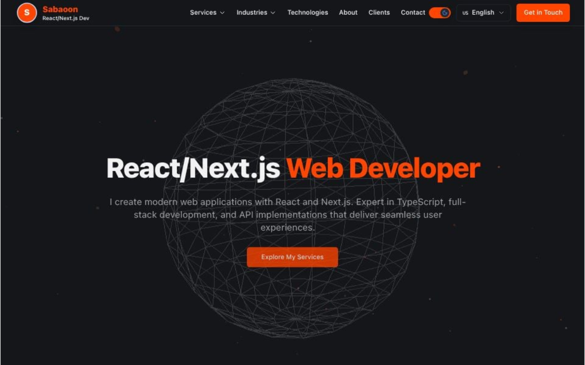

# Animated Portfolio

An open-source, production-ready portfolio template featuring 3D animations, smooth page transitions, and a modern tech stack. Built with React 19, TypeScript, and Three.js.

Perfect for developers, designers, and creatives who want a stunning portfolio with minimal setup.



### Demo Video
[Watch the demo video](public/demo.webm) - Showcases 3D animations, theme toggle, and language switching.

## Features

- **3D Animations** - Stunning WebGL backgrounds with Three.js and React Three Fiber
- **Smooth Transitions** - Page animations powered by Framer Motion
- **Dark/Light Theme** - Toggle between themes with preference persistence
- **9 Languages** - Full i18n support (English, German, Arabic, Japanese, Chinese, Indonesian, Spanish, French, Russian)
- **Contact Form** - Database-backed contact form with validation
- **Admin Panel** - Manage contact submissions at `/admin`
- **Responsive Design** - Mobile-first, works on all devices
- **File Upload** - Vercel Blob storage integration
- **Production-Ready** - Optimized for Vercel deployment
- **Type-Safe** - Full TypeScript implementation
- **Modern Styling** - Tailwind CSS for easy customization

## Supported Languages

| Language | Code | Flag |
|----------|------|------|
| English | en | US |
| German | de | DE |
| Arabic | ar | AR |
| Japanese | ja | JP |
| Chinese | zh | CN |
| Indonesian | id | ID |
| Spanish | es | ES |
| French | fr | FR |
| Russian | ru | RU |

Languages are auto-detected from browser preferences and can be changed via the language selector.

## Tech Stack

- **Frontend**: React 19, TypeScript, Tailwind CSS, React Router
- **3D Graphics**: Three.js, React Three Fiber, @react-three/drei
- **Animations**: Framer Motion
- **Backend**: Vercel Serverless Functions, Express 5
- **Database**: Vercel Postgres
- **Storage**: Vercel Blob
- **Build Tool**: Vite 7
- **Testing**: Selenium WebDriver
- **Icons**: Lucide React

## Project Structure

```
src/
├── components/     # React components (Hero, Header, Services, etc.)
├── config/         # Color configuration
├── contexts/       # Theme context provider
├── i18n/           # Language translations (9 languages)
├── utils/          # Performance utilities
├── App.tsx         # Main routing
└── main.tsx        # Entry point

api/                # Vercel serverless functions
├── contact.js      # Contact form API
├── admin/          # Admin endpoints
└── lib/            # Database utilities

tests/              # Selenium tests
└── selenium/       # Language verification tests
```

## Getting Started

### Prerequisites

- Node.js 18+
- npm or yarn

### Installation

1. Clone the repository:
   ```bash
   git clone https://github.com/sabaoongfx/Animated-Portfolio-React.git
   cd Animated-Portfolio-React
   ```

2. Install dependencies:
   ```bash
   npm install
   ```

3. Create a `.env` file based on `.env.example`:
   ```bash
   cp .env.example .env
   ```

4. Configure your environment variables in `.env`

5. Start the development server:
   ```bash
   npm run dev
   ```

## Environment Variables

Copy `.env.example` to `.env` and configure the following:

| Variable | Description |
|----------|-------------|
| `POSTGRES_URL` | Vercel Postgres connection URL |
| `POSTGRES_URL_NON_POOLING` | Vercel Postgres non-pooling URL |
| `ADMIN_EMAIL` | Admin panel login email |
| `ADMIN_SECRET` | Admin panel login password |
| `BLOB_READ_WRITE_TOKEN` | Vercel Blob storage token (auto-configured on Vercel) |

## Scripts

| Command | Description |
|---------|-------------|
| `npm run dev` | Start development server |
| `npm run build` | Build for production |
| `npm run preview` | Preview production build |
| `npm run lint` | Run ESLint |
| `npm test` | Run Selenium language tests |
| `npm run test:headless` | Run tests in headless mode |

## Testing

Selenium tests are included to verify language switching functionality.

### Prerequisites
- Chrome browser installed
- ChromeDriver matching your Chrome version

### Running Tests
```bash
# Start dev server first
npm run dev

# In another terminal, run tests
npm test

# Or run in headless mode
npm run test:headless
```

See [tests/README.md](tests/README.md) for more details.

## Deployment

This project is configured for deployment on Vercel:

1. Push your code to GitHub
2. Import the repository in Vercel
3. Configure environment variables in Vercel dashboard
4. Deploy

## License

MIT License - see [LICENSE](LICENSE) for details.

## Contributing

Contributions are welcome! Please feel free to submit a Pull Request.
